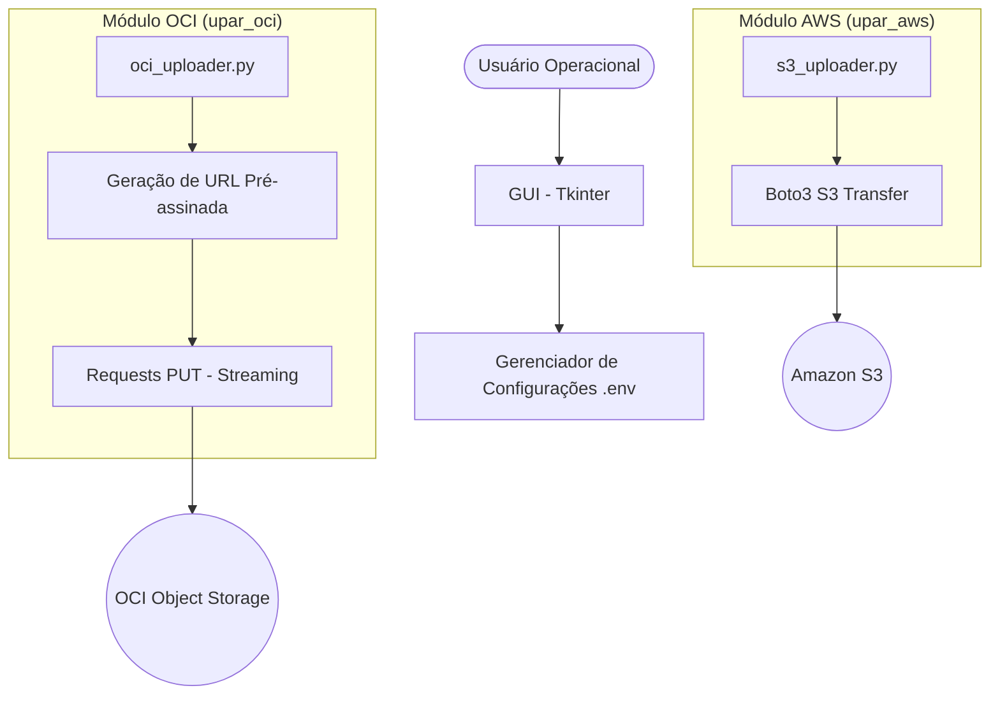

# Documentação de Arquitetura — Upar Objetos (Hybrid Cloud)

Esta documentação detalha a arquitetura técnica da ferramenta **Upar Objetos**, desenvolvida para facilitar o upload de arquivos de grande escala para provedores de Object Storage (**Amazon S3** e **Oracle Cloud OCI**).

## 1. Visão Geral

A solução é composta por dois módulos independentes que compartilham princípios de design, mas utilizam estratégias de upload distintas para otimizar o desempenho e a confiabilidade de acordo com o provedor.

- **Stack Tecnológica:** Python 3.10+, Tkinter (GUI), Boto3 (AWS SDK), Requests (HTTP Client).
- **Modelo de Deploy:** Desktop (Windows executável via PyInstaller).

## 2. Diagrama Conceitual

## 3. Componentes e Estratégias de Upload

### 3.1 Módulo AWS S3
Utiliza a biblioteca `boto3` com a classe `TransferConfig`. Esta abordagem permite:
- **Multipart Upload:** Divisão automática de arquivos grandes em partes menores.
- **Concorrência:** Upload paralelo de partes para maximizar o uso da banda.
- **Retentativas:** Mecanismos nativos de retry em caso de falhas de rede.

### 3.2 Módulo Oracle Cloud (OCI)
Devido a comportamentos específicos da API de compatibilidade S3 da OCI com cabeçalhos `Content-Length` em arquivos > 10GB, a arquitetura utiliza:
- **Presigned URLs:** `boto3` é usado apenas para assinar a requisição (V4).
- **Requests (Streaming):** O upload real é feito via método `PUT` da biblioteca `requests`, garantindo o envio correto de cabeçalhos e controle total sobre o stream de dados para evitar estouro de memória.

## 4. Segurança e Gestão de Estado
- **Persistência local:** Não há banco de dados. O estado e credenciais são salvos em arquivos `.env` locais no diretório da aplicação.
- **Isolamento:** As credenciais nunca deixam o ambiente local do usuário, exceto para autenticação direta com os endpoints oficiais da nuvem.

## 5. Build e Distribuição
O projeto utiliza `PyInstaller` com arquivos `.spec` customizados para embutir dependências e ícones, gerando um executável único para distribuição interna.
